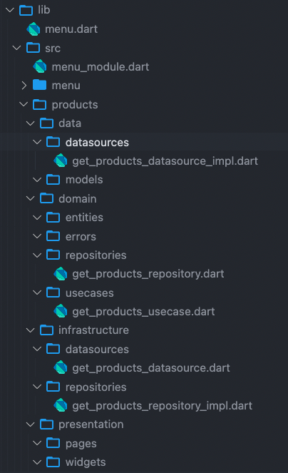

# clean-architecture-scaffolding README

It generates a folder structure according to your own template.
Take a look at the settings page.

## Features
 
Right-click on any folder in your project and then click "Clean Arch Scaffolding > New Feature".

Enter the name of your new feature

The directories will be created according to the template defined in the settings.

If you want to adapt the template, go to the extension settings and edit the json with the templates.

You can use some keywords to indicates special locations: 
- **{root_folder}** to '/lib'; 
- **{custom_folder}** to clicked folder; 
- **{feature_name}** to use the given custom name. 
**Ex:** '{root_folder}/{feature_name}/domain/usecases/'

## Extension Settings

Include if your extension adds any VS Code settings through the `contributes.configuration` extension point.

For example:

This extension contributes the following settings:

* `scaffolding.layers.templates`: Array of strings with folder template definitions.
* `scaffolding.layers.test`: Check to create the same structure in test folder too.

## Release Notes

This initial version generates only the folders.
In the next versions we will also add some file templates according to the context of the clicked folder.

## Following extension guidelines

Ensure that you've read through the extensions guidelines and follow the best practices for creating your extension.

* [Extension Guidelines](https://code.visualstudio.com/api/references/extension-guidelines)

**Enjoy!**
